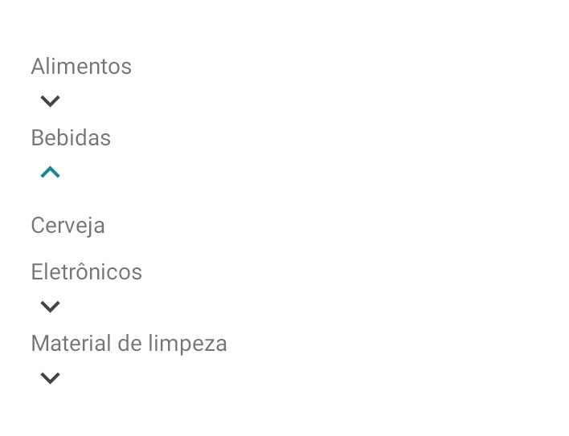

<!-- Component declaration begin -->

<!-- Component declaration end -->

<!-- Documentation begin -->

Esse componente tem como função auxiliar na manipulação, manutenção e padronização de acordeões dentro de uma aplicação.

### Visualização
> Não é possível renderizar componentes React Native diretamente na web, portanto, serão mostradas prints para exemplificar.



## Exemplo

### Fonte

```javascript
const AccordionArrayObject = [
  {
    title: 'Alimentos',
    content: 'Alface',
  },
  {
    title: 'Bebidas',
    content: 'Cerveja',
  },
  {
    title: 'Eletrônicos',
    content: 'Televisão',
  },
  {
    title: 'Material de limpeza',
    content: '***Alvejante***',
  },
];

<Accordion
  data={AccordionArrayObject}
  hasIcon
  activeIconColor="#189"
  inactiveIconColor="#444"
  isMarkdown
/>
```


## Atributos

| Formato            | Conceito                                                                                                | Tipo                 |
| ------------------ | ------------------------------------------------------------------------------------------------------- | -------------------- |
| **data**       | É o atributo que recebe os dados para gerar o acordeon.       | **AccordionType[]**   |
| **StyledBody?**       |  Aqui é definido o estilo do corpo do componente.      | **any**   |
| **StyledContent?**       |  Aqui é definido o estilo do conteúdo do componente.      | **any**   |
| **StyledHeader?**       |  Aqui é definido o estilo do cabeçalho do componente.      | **any**   |
| **StyledTitle?**       |  Aqui é definido o estilo do título do componente.      | **any**   |
| **activeIconColor?**       |  Define a cor do ícone do acordeão quando um item estiver ativado.      | **string**   |
| **children?** | Elementos filhos do componente.                                                     | **React.ReactNode** |
| **hasIcon**         | Define se existe algum ícone identificador de elemento aberto ou fechado. | **boolean**    |
| **iconDownName**         | Define algum ícone específico para identificar quando o conteúdo estiver escondido, vem do [**Material Community Icons**](https://oblador.github.io/react-native-vector-icons/). | **string**    |
| **iconDownName**         | Define algum ícone específico para identificar quando o conteúdo estiver exposto, vem do [**Material Community Icons**](https://oblador.github.io/react-native-vector-icons/). | **string**    |
| **inactiveIconColor?**       |  Define a cor do ícone do acordeão quando um item estiver desativado.      | **string**   |
| **isMarkdown**       |  Define se o conteúdo é markdown, assim é o possível utilizar das funcionalidades da extensão.      | **boolean**   |
| **key?** 	| Define a chave do componente. 	| **number, string** 	|
| **onChange?** 	| Evento que dispara uma função quando o estado do componente é alterado. 	| **number, string** 	|

<!-- Documentation end -->
