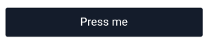

<!-- Component declaration begin -->

<!-- Component declaration end -->

<!-- Documentation begin -->

Esse componente tem como função auxiliar na manipulação, manutenção e padronização de botões dentro de uma aplicação.

### Visualização
> Não é possível renderizar componentes React Native diretamente na web, portanto, serão mostradas prints para exemplificar.



## Exemplo

### Fonte

```javascript
<Button
  accessibility="button"
  id="r32qera"
  typographyVariant="title4"
>
  Press me
</Button>
```


## Atributos

| Formato            | Conceito                                                                                                | Tipo                 |
| ------------------ | ------------------------------------------------------------------------------------------------------- | -------------------- |
| **accessibility**       | Aqui é declarada a acessibilidade.       | **string**   |
| **id**         | ID do componente. | **string**    |
| **accessibilityLabel**      | Define a palavra de acessibilidade.             | **string**  |
| **children?**    | Elementos filhos do componente.                                                          | **string** |
| **contrast?**    | Define se é pra ter contraste.  | **boolean**   |
| **children?** | Elementos filhos do componente.                                                     | **React.ReactNode** |
| **disabled?** | Define se o botão está clicável ou não.       | **boolean** |
| **haptic?** | Define o tipo de resposta tátil.                  | **"impact", "notification", "selection", "impactLight", "impactMedium", "impactHeavy", "notificationError", "notificationSuccess", "notificationWarning", undefined**
| **key?** 	| Define a chave do componente. 	| **number, string** 	|
| **loading?**   | Define se o componente está carregando. | **boolean**        |
| **onPress?**   | Evento disparado quando componente é pressionado. Quando evocado, chama uma função. | **function**        |
| **rounded?**   | Define se o botão deve ser arredondado. | **any**        |
| **secondary?**   | Define se a cor do botão é secundária. | **boolean**        |
| **style?**   | Define estilo para o botão. | **StyleProp< ViewStyle >**        |
| **tertiary?**   | Define se a cor do botão é terciária. | **boolean**        |
| **testID?**   | ID do componente quando utilizada em testes. | **string**        |
| **textStyle?**   | Define o estilo de texto. | **StyleProp< ViewStyle >**        |
| **typographyVariant?**   | Define a variante da tipografia de texto, para mais detalhes consulte o [styleguide do Typography](./). | **"body", "largeTitle", "title1", "title2", "title3", "title4", "headline", "subhead", "footnote", "caption1", "caption2", undefined**        |
| **variant?**   | Define o estilo de texto. | **StyleProp< ViewStyle >**        |

<!-- Documentation end -->
