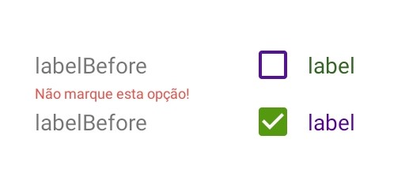

<!-- Component declaration begin -->

<!-- Component declaration end -->

<!-- Documentation begin -->

Esse componente tem como função auxiliar na manipulação, manutenção e padronização de caixas de seleção dentro de uma aplicação.

### Visualização



## Exemplo

### Fonte

```javascript
const [checked, setChecked] = useState(false);

<Checkbox
  accessibility="Caixa de seleção"
  id="a823ha32t2"
  uncheckedCheckBoxColor="#519"
  checkedCheckBoxColor="#591"
  checked={checked}
  onPress={() => setChecked(!checked)}
  label="label"
  labelBefore="labelBefore"
  labelStyle={{ color: '#362' }}
  error="Não marque esta opção!"
/>
<Checkbox
  accessibility="Caixa de seleção"
  id="a823ha32t2"
  uncheckedCheckBoxColor="#519"
  checkedCheckBoxColor="#591"
  checked={!checked}
  onPress={() => setChecked(!checked)}
  label="label"
  labelBefore="labelBefore"
  labelStyle={{ color: '#509' }}
/>
```

## Atributos

| Formato                     | Conceito                                                                                    | Tipo                             |
| --------------------------- | ------------------------------------------------------------------------------------------- | -------------------------------- |
| **accessibility**           | Aqui é declarada a acessibilidade.                                                          | **string**                       |
| **id**                      | ID do componente.                                                                           | **string**                       |
| **checkBoxColor?**          | Define uma cor para a caixa de seleção.                                                     | **string**                       |
| **checked?**                | Define se a caixa está marcada ou não.                                                      | **boolean**                      |
| **checkedCheckBoxColor?**   | Define a cor da caixa de seleção quando estiver selecionada.                                | **string**                       |
| **children?**               | Elementos filhos do componente.                                                             | **React.ReactNode**              |
| **error?**                  | Quando houver, define a mensagem que aparecerá em vermelho logo abaixo da caixa de seleção. | **string**                       |
| **key?**                    | Define a chave do componente.                                                               | **number, string**               |
| **label?**                  | Define a descrição da caixa de seleção.                                                     | **string**                       |
| **label?**                  | Define a descrição da caixa de seleção.                                                     | **string**                       |
| **labelBefore?**            | Define a descrição da caixa de seleção, porém esta fica à esquerda da caixa.                | **string**                       |
| **labelStyle?**             | Define o estilo do texto da descrição.                                                      | **stringStyleProp< TextStyle >** |
| **onPress?**                | Evento disparado quando componente é pressionado. Quando evocado, chama uma função.         | **function**                     |
| **style?**                  | Define o estilo do elemento.                                                                | **StyleProp< ViewStyle >**       |
| **uncheckedCheckBoxColor?** | Define a cor da caixa de seleção quando não estiver selecionada.                            | **string**                       |

<!-- Documentation end -->
