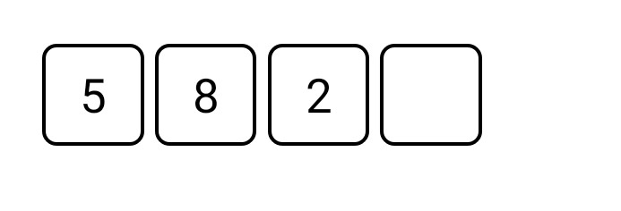

<!-- Component declaration begin -->

<!-- Component declaration end -->

<!-- Documentation begin -->

Esse componente tem como função auxiliar na manipulação, manutenção e padronização de caixas de inserção de códigos PIN dentro de uma aplicação.

### Visualização



## Exemplo

### Fonte

```jsx
const [pin, setPin] = useState('');

<PinInput
  editable
  restrictToNumbers
  onChangeText={(value) => setPin(value)}
  value={pin}
  animated
  autoFocus
/>
```


## Atributos

| Formato            | Conceito                                                                                                | Tipo                 |
| ------------------ | ------------------------------------------------------------------------------------------------------- | -------------------- |
| **onChangeText**   | Evento disparado quando o conteúdo do texto é alterado. Quando evocado, chama uma função. | **function**        |
| **accessibility?**       | Aqui é declarada a acessibilidade.       | **string**   |
| **animated?**       | Aqui é definido se há ou não animação, (a caixa onde armazenará o próximo número a ser inserido fica pulsando).       | **boolean**   |
| **autoFocus?**       | Aqui é definido se o componente deve ser focado assim que renderizado (que aparece o teclado direto).       | **boolean**   |
| **caption?**       | Aqui é declarada o subtítulo do componente, (logo abaixo da caixa inserção).       | **string**   |
| **cellSize?**       | Aqui é declarado o tamanho das células do componente.       | **number**   |
| **cellSpacing?**       | Aqui é declarado o espaçamento das células entre si.       | **number**   |
| **cellStyle?**       | Aqui é declarado o estilo da célula.       | **any**   |
| **cellStyleFocused?**       | Aqui é declarado o estilo da célula quando estiver focada.       | **any**   |
| **centered?**       | Aqui é definido se o componente deve estar centralizado.       | **boolean**   |
| **children?** | Elementos filhos do componente.                                                     | **React.ReactNode** |
| **codeLength?**       | Aqui é declarado a quantia de caracteres que o código terá.       | **number**   |
| **editable?**       | Aqui é definido se é possível editar.       | **number**   |
| **error?**       | Aqui é definido se existe erro de inserção.       | **string, boolean**   |
| **iconSize?**       | Aqui é definido o tamanho do ícone (quando o atributo *password* for verdadeiro, define o tamanho do olho).       | **number**   |
| **id?**         | ID do componente. | **string**    |
| **key?** 	| Define a chave do componente. 	| **number, string** 	|
| **keyBoardType?** 	| Define o tipo do teclado, podendo ser: *url*, *numeric*, *default*, *email-address*, *phone-pad*, *number-pad*, *decimal-pad*, *visible-password*, *ascii-capable*, *numbers-and-punctuation*, *name-phone-pad*, *twitter*, *web-search*, *undefined*. 	| **number, string** 	|
| **mask?** 	| Define um padrão de máscara para a caixa de inserção. 	| **string, JSX.Element** 	|
| **maskDelay?** 	| Define um valor de espera para a máscara. 	| **number** 	|
| **onBackSpace?**   | Evento disparado quando o usuário fizer uso do *backspace* na hora da inserção. Quando evocado, chama uma função. | **function**        |
| **onFullfill?**   | Evento disparado quando o usuário completar a inserção. Quando evocado, chama uma função. | **function**        |
| **password?**   | Define se é uma senha que está sendo inserida (quando verdadeira um olho é renderizado à direita do componente). | **boolean**        |
| **placeholder?**   | Define um caractere que quando a célula estiver vazia, esse caractere preencherá este lugar. | **string**        |
| **restrictToNumbers?**   | Define se só serão inseridos números. | **boolean**        |
| **textStyle?**    | Define o estilo do texto.        | **any** |
| **textStyleFocused?**    | Define o estilo do texto quando focado.        | **any** |
| **value?**    | Valor que será renderizado nas células, armazena o que o usuário insere.        | **string** |

<!-- Documentation end -->
