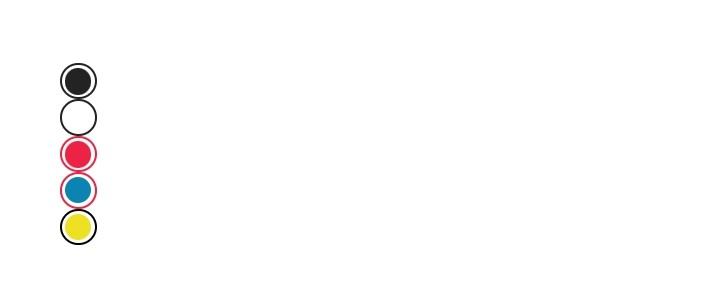

<!-- Component declaration begin -->

<!-- Component declaration end -->

<!-- Documentation begin -->

Esse componente tem como função auxiliar na manipulação, manutenção e padronização botões de radio dentro de uma aplicação.

### Visualização
> Não é possível renderizar componentes React Native diretamente na web, portanto, serão mostradas prints para exemplificar.



## Exemplo

### Fonte

```javascript
<RadioButton accessibility="radio button" id="12r4y5" checked={true} />
<RadioButton accessibility="radio button" id="11r4y5" checked={false} />
<RadioButton
  accessibility="radio button"
  id="32r1y6"
  checkedRadioButtonColor="#e24"
  checked={true}
  radioButtonColor="#e24"
/>
<RadioButton
  accessibility="radio button"
  id="35r4y5"
  checkedRadioButtonColor="#0b84b4"
  checked={true}
  radioButtonColor="#e24"
/>
<RadioButton
  accessibility="radio button"
  id="32r405"
  checkedRadioButtonColor="#eee022"
  checked={true}
  radioButtonColor="#000"
/>
```


## Atributos

| Formato            | Conceito                                                                                                | Tipo                 |
| ------------------ | ------------------------------------------------------------------------------------------------------- | -------------------- |
| **accessibility**       | Aqui é declarada a acessibilidade.       | **string**   |
| **id**         | ID do componente. | **string**    |
| **checked?**      | Define se a caixa está marcada ou não.             | **boolean**  |
| **checkRadioButtonColor?**         | Define uma cor para o botão de rádio quando estiver marcado. | **string**    |
| **children?** | Elementos filhos do componente.                                                     | **React.ReactNode** |
| **internalSize?** 	| Define o tamanho do círculo interno, que aparece quando o componente está marcado. 	| **number** 	|
| **key?** 	| Define a chave do componente. 	| **number, string** 	|
| **onPress?**   | Evento disparado quando componente é pressionado. Quando evocado, chama uma função. | **function**        |
| **radioButtonColor?**         | Define uma cor para o botão de rádio quando estiver marcado. | **string**    |
| **size?** 	| Define o tamanho do círculo externo. 	| **number** 	|

<!-- Documentation end -->
