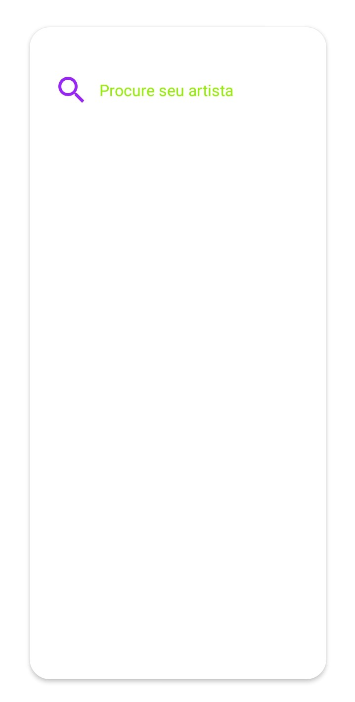

<!-- Component declaration begin -->

<!-- Component declaration end -->

<!-- Documentation begin -->

Esse componente tem como função auxiliar na manipulação, manutenção e padronização de botões de busca dentro de uma aplicação.

### Visualização



## Exemplo

### Fonte

```javascript
<SearchInput
  accessibility="Pesquisar"
  id="f8972g3786"
  onChange={() => {}}
  hasShadow
  iconSize={36}
  iconColor="#92f"
  placeholder="Procure seu artista"
  placeholderTextColor="#92f000"
  leftIcon
/>
```


## Atributos

| Formato            | Conceito                                                                                                | Tipo                 |
| ------------------ | ------------------------------------------------------------------------------------------------------- | -------------------- |
| **accessibility**       | Aqui é declarada a acessibilidade.       | **string**   |
| **id**         | ID do componente. | **string**    |
| **onChange**   | Evento disparado quando o conteúdo do componente for alterado. Quando evocado, chama uma função. | **function**        |
| **children?** | Elementos filhos do componente.                                                     | **React.ReactNode** |
| **containerStyle?** 	| Define o estilo do container do componente. 	| **StyleProp< ViewStyle >** 	|
| **hasShadow?**      | Define se o componente tem sombreamento.             | **boolean**  |
| **iconColor?** 	| Define a cor do ícone (lupa) do componente. 	| **string** 	|
| **iconSize?** 	| Define o tamanho do ícone (lupa) do componente. 	| **number** 	|
| **inputPadding?** 	| Define o atributo *padding* do componente. 	| **number** 	|
| **inputStyle?** 	| Define o estilo interno do componente. 	| **StyleProp< ViewStyle >** 	|
| **key?** 	| Define a chave do componente. 	| **number, string** 	|
| **leftIcon?**      | Define se o ícone deve estar à esquerda do componente.             | **boolean**  |
| **onBlur?**   | Evento disparado quando o componente for desfocado. Quando evocado, chama uma função. | **function**        |
| **onClear?**   | Evento disparado quando o componente for limpo. Quando evocado, chama uma função. | **function**        |
| **onFocus?**   | Evento disparado quando o componente for focado. Quando evocado, chama uma função. | **function**        |
| **placeholder?** | Define uma descrição interna para o componente. | **string**                  |
| **placeholderTextColor?** | Define a cor do *placeholder*. | **string**                  |
| **textStyle?** | Define o estilo do texto a ser inserido. | **StyleProp< ViewStyle >**                  |
| **wrapperHeight?** | Define a altura do componente. | **number**                  |

<!-- Documentation end -->
