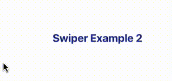
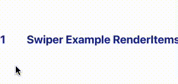
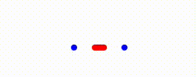

<!-- Component declaration begin -->

<!-- Component declaration end -->

<!-- Documentation begin -->

O Swiper cria componentes "deslizáveis" dentro de uma aplicação.
Pode ser implementado de  2 formas: children ou renderItems

## Exemplo com children

Por esse método, o swiper cria os "deslizáveis" a partir dos componentes filhos passados como children

### Visualização



### Fonte

```typescript
import { Swiper } from '@platformbuilders/fluid-react-native';
.
.
.
<Swiper accessibility={'swiper com children'}>
  <SwiperItem>
    <Title>Swiper Example 1</Title>
  </SwiperItem>
  <SwiperItem>
    <Title>Swiper Example 2</Title>
  </SwiperItem>
  <SwiperItem>
    <Title>Swiper Example 3</Title>
  </SwiperItem>
</Swiper>
```

## Exemplo com renderItems
Por esse método, o swiper cria os "deslizáveis" a partir de um array de dados e a função renderItem similar ao usado na FlatList.

### Visualização



### Fonte

```typescript
import { Swiper } from '@platformbuilders/fluid-react-native';
import { ListRenderItem } from 'react-native';
.
.
.
const renderItem: ListRenderItem<string> = ({ item }) => {
  return (
    <SwiperItem>
      <Title>{item}</Title>
    </SwiperItem>
  );
};

return (
  <Swiper
    accessibility={'swiper com renderItems'}
    data={[
      'Swiper Example RenderItems 1',
      'Swiper Example RenderItems 2',
      'Swiper Example RenderItems 3',
    ]}
    renderItem={renderItem}
  />
);
```
## Exemplo com Pagination (SwiperPagination)
O Swiper disponibiliza um componente padrão de paginação, o SwiperPagination, sendo exibido ao passar a prop showPagination={true}
Sua estilização pode ser feita de 2 formas, usando props de estilização diretamente no componente de Swiper ou criando um componente de Paginação customizável utilizando o SwiperPagination.
No exemplo é possível obter o mesmo resultado das duas formas citadas.

### Visualização



### Fonte
```typescript
import {Swiper, SwiperPagination, SwiperPaginationProps } from '@platformbuilders/fluid-react-native';
.
.
.

// Utilizando props do Swiper
<Swiper
  accessibility="swiper com pagination"
  showPagination={true}
  paginationActiveColor="red"
  paginationDefaultColor="blue"
  paginationStyleItem={{
    width: 8,
    height: 8,
  }}
  paginationStyleItemActive={{
    width: 20,
    height: 8,
  }} 
/>

// Utilizando componente Customizável
const PaginationCustom = (paginationProps: SwiperPaginationProps) => {
  return (
    <SwiperPagination
      {...paginationProps}
      paginationActiveColor="red"
      paginationDefaultColor="blue"
      paginationStyleItem={{
        width: 8,
        height: 8,
      }}
      paginationStyleItemActive={{
        width: 20,
        height: 8,
      }}
    />
  );
};

return (
  <Swiper
    accessibility="swiper com pagination custom"
    PaginationComponent={PaginationCustom}
    showPagination={true}
    .
    .
    .

```

## Atributos

| Formato | Conceito | Tipo |
|---|---|---|
| **accessibility** | Aqui é declarada a acessibilidade. | **string** |
| **id** | ID do componente. | **string** |
| **accessibilityLabel** | Define a palavra de acessibilidade. | **string** |
| **children?** | Elementos filhos do componente. | **React.ReactNode** |
| **renderItem** | Obtém um item da prop data e renderiza em uma lista | **FlatListProps['renderItem']** |
| **onMomentumScrollEnd** | Chamado após o fim do scroll e retorna o índice atual | **(item: { index: number }, event: any)** |
| **vertical** | Exibe um swiper vertical (Não funciona no Android) | **boolean**  |
| **index** | Posição em que o Swiper inicia | **number** |
| **renderAll** | Renderiza todos os itens antes de serem exibidos | **boolean** |
| **showPagination** | Exibe paginação | **boolean** |
| **paginationDefaultColor** | Cor da paginação inativa | **string** |
| **paginationActiveColor** | Cor da paginação ativa | **string** |
| **paginationStyle** | Define estilo para o container | **StyleProp< ViewStyle >** |
| **paginationStyleItem** | Define estilo para o dot | **StyleProp< ViewStyle >** |
| **paginationStyleItemActive** | Define estilo para o dot ativo | **StyleProp< ViewStyle >** |
| **paginationStyleItemInactive** | Define estilo para o dot inativo | **StyleProp< ViewStyle >** |
| **onPaginationSelectedIndex** | Executado quando o usuário pressiona o índice de paginação | **() => void** |
| **PaginationComponent** | Componente de paginação customizado | **SwiperPagination** |
| **autoplay** | Muda a página atual automáticamente | *boolean** |
| **autoplayDelay** | Tempo de espera entre cada página | **number** |
| **autoplayLoop** | Volta para página inicial após última página | **boolean** |
| **autoplayLoopKeepAnimation** | Exibe animação quando chega ao fim da lista | **boolean** |
| **autoplayInvertDirection** | Inverte direção da troca de páginas automática | **boolean** |
| **disableGesture** | Desativa o gesto de deslizar | **boolean** |
| **key?** | Define a chave do componente. | **number, string** |
| **style?** | Define estilo para o swiper | **StyleProp< ViewStyle >** |
| **testID?** | ID do componente quando utilizada em testes. | **string** |

##  Funções

Funções disponíveis a partir da referência do componente de Swiper.

### Fonte
```typescript
import { Swiper, SwiperRefProps } from '@platformbuilders/fluid-react-native';
.
.
.

const swiperRef = useRef<SwiperRefProps>(null);
return (
  <Swiper
    accessibility='swiper_com_ref'
    swiperRef={swiperRef}
    .
    .
    .
  />

```

## Atributos
| Formato | Conceito | Tipo |
|---|---|---|
| **scrollToIndex** | Scroll para posição | ({ index: number, animated?: boolean}) => void |
| **getCurrentIndex** | Retorna a posição atual | () => number |
| **getPrevIndex** | Retorna a posição anterior | () => number |
| **onChangeIndex** | Executado toda vez que a posição muda, a posição muda quando o usuário atinge 60% da próxima tela | ({ index: number, prevIndex: number}) => void |
| **goToFirstIndex** | Move para primeira posição | () => void |
| **goToLastIndex** | Move para última posição | () => void |
