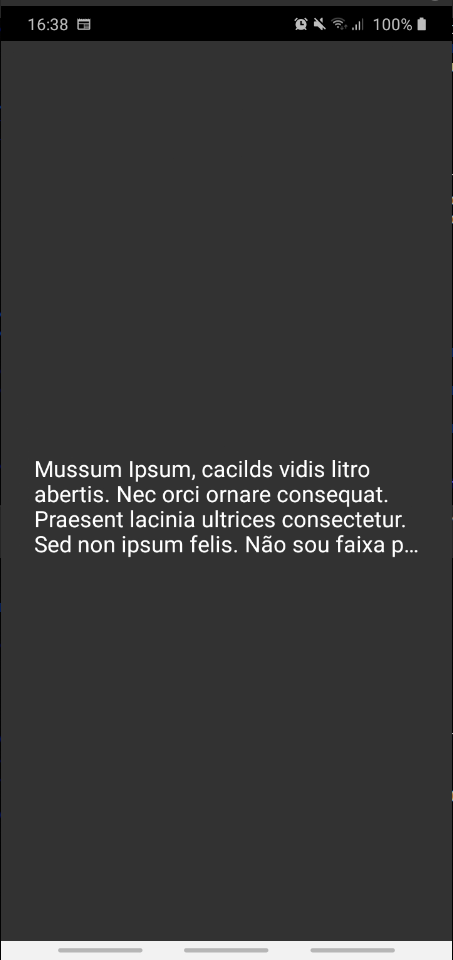

<!-- Component declaration begin -->

<!-- Component declaration end -->

<!-- Documentation begin -->

Esse componente tem como função auxiliar na manipulação, manutenção e padronização da tipografia dentro de uma aplicação.

## Exemplo

### Visualização



### Fonte

```javascript
<Typography
  accessibility="Accessibility example"
  id="typo_edj8q73h98734gt7834g"
  key="typo_edj8q73h98734gt7834g"
  numberOfLines={4}
  variant="title4"
  style={{ color: '#fff' }}
>
  Mussum Ipsum, cacilds vidis litro abertis. Nec orci ornare consequat.
  Praesent lacinia ultrices consectetur. Sed non ipsum felis. Não sou
  faixa preta cumpadi, sou preto inteiris, inteiris. Detraxit consequat et
  quo num tendi nada. Interessantiss quisso pudia ce receita de bolis,
  mais bolis eu num gostis.
</Typography>
```


## Atributos

| Formato            | Conceito                                                                                                | Tipo                 |
| ------------------ | ------------------------------------------------------------------------------------------------------- | -------------------- |
| **accessibility?**       | Aqui é declarada a acessibilidade.       | **string**   |
| **children?** | Aqui é declarado texto.                                                     | **string** |
| **id**         | ID do componente. | **string**    |
| **key?** 	| Define a chave do componente. 	| **React.Key, null, undefined** 	|
| **numberOfLines?** 	| Define o máximo número de linhas renderizáveis. Quando há um texto que precisa de mais linhas que o máximo, no final da última linha aparecerá "...", assim como está no exemplo acima. 	| **number** 	|
| **textRef?** 	| Define uma referência para o texto. 	| **any** 	|
| **variant?** 	| Define qual a variação da tipografia, podendo ser do tipo: *button, caption, h1, h2, h3, h4, h5, h6, subtitle1, subtitle2, body1, body2, overline*. 	| **TypographyVariants** 	|

<!-- Documentation end -->
