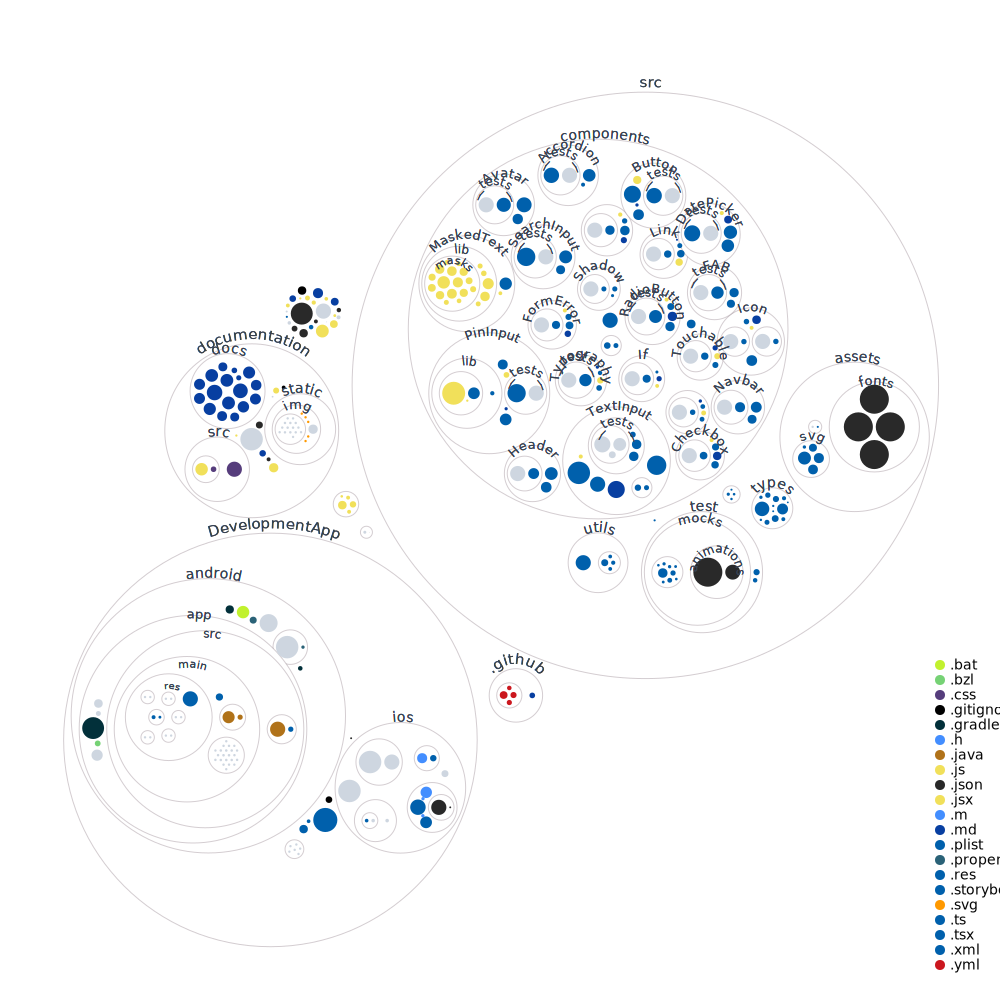

<!-- Component declaration begin -->

<!-- Component declaration end -->

<!-- Documentation begin -->

É possível também, visualizar graficamente como está organizado o repositório em forma de "fingerprint".

Mais detalhes de como foi gerado esse gráfico, só dar uma olhada [aqui](https://octo.github.com/projects/repo-visualization)!
