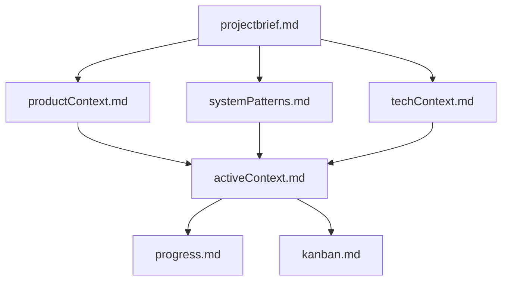

# Banco de Memória Obsidian - Fluid React Native

Este cofre Obsidian contém a memória estruturada do projeto Fluid React Native, permitindo continuidade entre sessões e um registro organizado de conhecimento.

## Arquivos Principais

1. [**projectbrief.md**](./projectbrief.md) - Define o escopo do projeto, metas e requisitos.
2. [**productContext.md**](./productContext.md) - Explica o propósito, as necessidades dos usuários e declarações de problemas.
3. [**systemPatterns.md**](./systemPatterns.md) - Documenta a arquitetura, padrões de design e escolhas técnicas.
4. [**techContext.md**](./techContext.md) - Lista tecnologias, dependências e restrições.
5. [**activeContext.md**](./activeContext.md) - Acompanha mudanças recentes, próximos passos e decisões.
6. [**progress.md**](./progress.md) - Registra o status, o trabalho concluído e as pendências.
7. [**kanban.md**](./kanban.md) - Acompanha as tarefas utilizando o formato Obsidian Kanban.

## Estrutura Visual

## Comandos

- **"continue instruções"** – Carregar e ler os arquivos do Banco de Memória
- **"iniciar memória"** – Configurar o cofre com autoescaneamento, grafo de conhecimento e monitoramento Kanban
- **"atualizar memória"** – Revisar os documentos, atualizar conexões e o quadro Kanban
- **"buscar [informação]"** – Buscar informações específicas

## Padrões e Fluxos de Trabalho

Os padrões e fluxos de trabalho são registrados no arquivo [.cursorrules](../.cursorrules), que evolui com o projeto e contém diretrizes importantes para o desenvolvimento. 